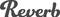

#  reverb **flow**ground Connector

## Description

A generated **flow**ground connector for the reverb API (version 3.0).

Generated from: https://api.apis.guru/v2/specs/reverb.com/3.0/swagger.json 
Generated at: 2019-05-07T17:43:53+03:00

## API Description

reverb

## Authorization

Supported authorization schemes:
- OAuth2

For OAuth 2.0 you need to specify OAuth Client credentials as environment variables in the connector repository:
* `OAUTH_CLIENT_ID` - your OAuth client id
* `OAUTH_CLIENT_SECRET` - your OAuth client secret

## Actions

### get_articles

*Tags:* `articles`

#### Input Parameters
* `page` - _optional_
* `per_page` - _optional_
* `offset` - _optional_
* `query` - _optional_ - What's being searched for
* `exclude_featured` - _optional_ - Number of featured articles to exclude

### List of all article categories

*Tags:* `articles`

### List of supported product categories

*Tags:* `categories`

### get_categories_flat

*Tags:* `categories`

### Full taxonomy tree of categories including middle categories

*Tags:* `categories`

### Get subcategory details

*Tags:* `categories`

#### Input Parameters
* `product_type` - _required_
* `category` - _required_

### Get category details

*Tags:* `categories`

#### Input Parameters
* `uuid` - _required_

### Returns a set of comparison shopping pages based on the current params

*Tags:* `comparison_shopping_pages`

### Show comparison shopping page

*Tags:* `comparison_shopping_pages`

#### Input Parameters
* `id` - _optional_ - ID of the comparison shopping page
* `slug` - _optional_ - Slug of the comparison shopping page

### get_comparison_shopping_pages__id_

*Tags:* `comparison_shopping_pages`

#### Input Parameters
* `id` - _required_

### Return new or used listings for a comparison shopping page

*Tags:* `comparison_shopping_pages`

#### Input Parameters
* `id` - _required_
* `condition` - _required_ - Condition of the listing
* `page` - _optional_
* `per_page` - _optional_
* `offset` - _optional_

### View reviews of a comparison shopping page

*Tags:* `comparison_shopping_pages`

#### Input Parameters
* `id` - _required_

### Make an offer to the other participant in the conversation

*Tags:* `conversations`

#### Input Parameters
* `conversation_id` - _required_

### Make an offer to the other participant in the conversation

*Tags:* `conversations`

#### Input Parameters
* `id` - _required_

### Retrieve a list of country codes with corresponding subregions

*Tags:* `countries`

### Returns a set of comparison shopping pages based on the current params

*Tags:* `csps`

### get_csps_categories

*Tags:* `csps`

### get_curated_sets__slug_

*Tags:* `curated_sets`

#### Input Parameters
* `slug` - _required_

### List of supported display currencies for browsing listings

*Tags:* `currencies`

### List of supported listing currencies for shops

*Tags:* `currencies`

### Feedback details

*Tags:* `feedback`

#### Input Parameters
* `feedback_id` - _required_

### Get results from a handpicked collection

*Tags:* `handpicked`

#### Input Parameters
* `slug` - _required_
* `query` - _optional_ - Search query.
* `auction_price_max` - _optional_ - Maximum current auction price
* `category` - _optional_ - Category slug from /api/categories
* `product_type` - _optional_ - Product type slug from /api/categories
* `conditions` - _optional_ - Condition: all,new,b-stock,used,non-functioning
* `decade` - _optional_ - Decade: e.g. 1970s, early 70s
* `finish` - _optional_ - Visual finish of the item, common for guitars
* `handmade` - _optional_ - Handmade items only
* `item_city` - _optional_ - City where item is located
* `item_country` - _optional_ - DEPRECATED - Country code where item is located
* `item_region` - _optional_ - Country code where item is located
* `item_state` - _optional_ - State or region code where item is located
* `make` - _optional_ - Make(s)/brand of item (e.g. Fender). Can take a single value or an array.
* `model` - _optional_ - Model of item (e.g. Stratocaster)
* `must_not` - _optional_ - Search term negation. If you want to exclude a term, add it here
* `price_max` - _optional_ - Maximum price of search results (USD)
* `price_min` - _optional_ - Minimum price of search results (USD)
* `currency` - _optional_ - The currency to be used for the price filters
* `year_max` - _optional_ - Maximum year of manufacture
* `year_min` - _optional_ - Minumum year of manufacture
* `accepts_gift_cards` - _optional_ - If true, include only items that accept gift cards
* `preferred_seller` - _optional_ - If true, include only items by Reverb Preferred Sellers
* `shop` - _optional_ - Slug of shop to search
* `shop_id` - _optional_ - ID of shop to search
* `listing_type` - _optional_ - Type of listing: auctions,offers
* `ships_to` - _optional_ - Limit search to items that ship to this country code
* `exclude_auctions` - _optional_ - If true, exclude auctions
* `accepts_payment_plans` - _optional_ - If true, only show items that can be purchased with a payment plan
* `watchers_count_min` - _optional_ - Minimum number of watchers (used to find popular items)
* `not_ids` - _optional_ - Listing ID negation. If you want to exclude a listing, add it here.
* `page` - _optional_
* `per_page` - _optional_
* `offset` - _optional_

### List of supported product conditions

*Tags:* `listing_conditions`

### Default search of listings includes only used & handmade. Add a filter to view all listings or use the /listings/all endpoint.

*Tags:* `listings`

#### Input Parameters
* `query` - _optional_ - Search query.
* `auction_price_max` - _optional_ - Maximum current auction price
* `category` - _optional_ - Category slug from /api/categories
* `product_type` - _optional_ - Product type slug from /api/categories
* `conditions` - _optional_ - Condition: all,new,b-stock,used,non-functioning
* `decade` - _optional_ - Decade: e.g. 1970s, early 70s
* `finish` - _optional_ - Visual finish of the item, common for guitars
* `handmade` - _optional_ - Handmade items only
* `item_city` - _optional_ - City where item is located
* `item_country` - _optional_ - DEPRECATED - Country code where item is located
* `item_region` - _optional_ - Country code where item is located
* `item_state` - _optional_ - State or region code where item is located
* `make` - _optional_ - Make(s)/brand of item (e.g. Fender). Can take a single value or an array.
* `model` - _optional_ - Model of item (e.g. Stratocaster)
* `must_not` - _optional_ - Search term negation. If you want to exclude a term, add it here
* `price_max` - _optional_ - Maximum price of search results (USD)
* `price_min` - _optional_ - Minimum price of search results (USD)
* `currency` - _optional_ - The currency to be used for the price filters
* `year_max` - _optional_ - Maximum year of manufacture
* `year_min` - _optional_ - Minumum year of manufacture
* `accepts_gift_cards` - _optional_ - If true, include only items that accept gift cards
* `preferred_seller` - _optional_ - If true, include only items by Reverb Preferred Sellers
* `shop` - _optional_ - Slug of shop to search
* `shop_id` - _optional_ - ID of shop to search
* `listing_type` - _optional_ - Type of listing: auctions,offers
* `ships_to` - _optional_ - Limit search to items that ship to this country code
* `exclude_auctions` - _optional_ - If true, exclude auctions
* `accepts_payment_plans` - _optional_ - If true, only show items that can be purchased with a payment plan
* `watchers_count_min` - _optional_ - Minimum number of watchers (used to find popular items)
* `not_ids` - _optional_ - Listing ID negation. If you want to exclude a listing, add it here.
* `page` - _optional_
* `per_page` - _optional_
* `offset` - _optional_

### Create a listing

*Tags:* `listings`

### All listings including used, handmade, and brand new

*Tags:* `listings`

#### Input Parameters
* `query` - _optional_ - Search query.
* `auction_price_max` - _optional_ - Maximum current auction price
* `category` - _optional_ - Category slug from /api/categories
* `product_type` - _optional_ - Product type slug from /api/categories
* `conditions` - _optional_ - Condition: all,new,b-stock,used,non-functioning
* `decade` - _optional_ - Decade: e.g. 1970s, early 70s
* `finish` - _optional_ - Visual finish of the item, common for guitars
* `handmade` - _optional_ - Handmade items only
* `item_city` - _optional_ - City where item is located
* `item_country` - _optional_ - DEPRECATED - Country code where item is located
* `item_region` - _optional_ - Country code where item is located
* `item_state` - _optional_ - State or region code where item is located
* `make` - _optional_ - Make(s)/brand of item (e.g. Fender). Can take a single value or an array.
* `model` - _optional_ - Model of item (e.g. Stratocaster)
* `must_not` - _optional_ - Search term negation. If you want to exclude a term, add it here
* `price_max` - _optional_ - Maximum price of search results (USD)
* `price_min` - _optional_ - Minimum price of search results (USD)
* `currency` - _optional_ - The currency to be used for the price filters
* `year_max` - _optional_ - Maximum year of manufacture
* `year_min` - _optional_ - Minumum year of manufacture
* `accepts_gift_cards` - _optional_ - If true, include only items that accept gift cards
* `preferred_seller` - _optional_ - If true, include only items by Reverb Preferred Sellers
* `shop` - _optional_ - Slug of shop to search
* `shop_id` - _optional_ - ID of shop to search
* `listing_type` - _optional_ - Type of listing: auctions,offers
* `ships_to` - _optional_ - Limit search to items that ship to this country code
* `exclude_auctions` - _optional_ - If true, exclude auctions
* `accepts_payment_plans` - _optional_ - If true, only show items that can be purchased with a payment plan
* `watchers_count_min` - _optional_ - Minimum number of watchers (used to find popular items)
* `not_ids` - _optional_ - Listing ID negation. If you want to exclude a listing, add it here.
* `page` - _optional_
* `per_page` - _optional_
* `offset` - _optional_

### Individual facets

*Tags:* `listings`

### Returns the latest negotiation for the requesting user given a listing id

*Tags:* `listings`

#### Input Parameters
* `id` - _required_

### Make an offer to the seller of a listing

*Tags:* `listings`

#### Input Parameters
* `id` - _required_

### View available bump tiers and stats for a listing

*Tags:* `listings`

#### Input Parameters
* `listing_id` - _required_

### Bump a listing

*Tags:* `listings`

#### Input Parameters
* `listing_id` - _required_
* `budget_type` - _required_

### Start a conversation with a seller

*Tags:* `listings`

#### Input Parameters
* `listing_id` - _required_

### View the images associated with a particular listing

*Tags:* `listings`

#### Input Parameters
* `listing_id` - _required_

### Delete an image from a listing

*Tags:* `listings`

#### Input Parameters
* `listing_id` - _required_
* `image_id` - _required_

### Find a product bundle attached to a listing

*Tags:* `listings`

#### Input Parameters
* `listing_id` - _required_
* `for_seller` - _optional_ - Pass to see non-live bundles as the seller

### See all sales that include a listing.

*Tags:* `listings`

#### Input Parameters
* `listing_id` - _required_

### Delete a draft listing. Cannot be used on non-drafts.

*Tags:* `listings`

#### Input Parameters
* `slug` - _required_

### Listing details

*Tags:* `listings`

#### Input Parameters
* `slug` - _required_

### Update a listing

*Tags:* `listings`

#### Input Parameters
* `slug` - _required_

### Edit listing.

*Tags:* `listings`

#### Input Parameters
* `slug` - _required_

### Flag a listing for inappropriate content or fraud

*Tags:* `listings`

#### Input Parameters
* `slug` - _required_

### View reviews of a listing

*Tags:* `listings`

#### Input Parameters
* `slug` - _required_

### Create a review for a listing

*Tags:* `listings`

#### Input Parameters
* `slug` - _required_

### Listing details

*Tags:* `listings`

#### Input Parameters
* `slug` - _required_

### Get account details

*Tags:* `my`

### Update account details

*Tags:* `my`

### See all addresses in your address book

*Tags:* `my`

### Create a new address in your address book

*Tags:* `my`

### Delete an existing address in your address book

*Tags:* `my`

#### Input Parameters
* `address_id` - _required_

### Update an existing address in your address book

*Tags:* `my`

#### Input Parameters
* `address_id` - _required_

### Get a list of your conversations

*Tags:* `my`

#### Input Parameters
* `search` - _optional_ - Query string to search conversations by
* `unread_only` - _optional_ - Show unread conversations only
* `page` - _optional_
* `per_page` - _optional_
* `offset` - _optional_

### Start a conversation

*Tags:* `my`

### Send a message

*Tags:* `my`

#### Input Parameters
* `conversation_id` - _required_

### Display conversation details with messages in natural time order (oldest to newest)

*Tags:* `my`

#### Input Parameters
* `id` - _required_

### Mark a conversation read/unread

*Tags:* `my`

#### Input Parameters
* `id` - _required_

### Get your actionable status counts

*Tags:* `my`

### delete_my_curated_set_product__product_id_

*Tags:* `my`

#### Input Parameters
* `product_id` - _required_

### post_my_curated_set_product__product_id_

*Tags:* `my`

#### Input Parameters
* `product_id` - _required_

### Get listings from your feed

*Tags:* `my`

### get your feed customization options

*Tags:* `my`

### get your feed

*Tags:* `my`

### List of received feedback

*Tags:* `my`

### List of sent feedback

*Tags:* `my`

### See what the user is following

*Tags:* `my`

### Returns a user's ArticleCategoryFollows

*Tags:* `my`

### Set a user's ArticleCategoryFollows

*Tags:* `my`

### Unfollow a brand

*Tags:* `my`

#### Input Parameters
* `slug` - _required_

### Follow status for a brand

*Tags:* `my`

#### Input Parameters
* `slug` - _required_

### Follow a brand

*Tags:* `my`

#### Input Parameters
* `slug` - _required_

### Unfollow a subcategory

*Tags:* `my`

#### Input Parameters
* `category` - _required_
* `subcategory` - _required_

### Follow status for a subcategory

*Tags:* `my`

#### Input Parameters
* `category` - _required_
* `subcategory` - _required_

### Follow a subcategory

*Tags:* `my`

#### Input Parameters
* `category` - _required_
* `subcategory` - _required_

### Unfollow a category

*Tags:* `my`

#### Input Parameters
* `identifier` - _required_

### Follow status for a category

*Tags:* `my`

#### Input Parameters
* `identifier` - _required_

### Follow a category

*Tags:* `my`

#### Input Parameters
* `identifier` - _required_

### Follow a category

*Tags:* `my`

#### Input Parameters
* `uuid` - _required_

### Unfollow a collection

*Tags:* `my`

#### Input Parameters
* `slug` - _required_

### Follow status for a collection

*Tags:* `my`

#### Input Parameters
* `slug` - _required_

### Follow a collection

*Tags:* `my`

#### Input Parameters
* `slug` - _required_

### Unfollow a handpicked collection

*Tags:* `my`

#### Input Parameters
* `slug` - _required_

### Follow status for a handpicked collection

*Tags:* `my`

#### Input Parameters
* `slug` - _required_

### Follow a handpicked collection

*Tags:* `my`

#### Input Parameters
* `slug` - _required_

### Follow status for a search

*Tags:* `my`

### Follow a search

*Tags:* `my`

### Unfollow a shop

*Tags:* `my`

#### Input Parameters
* `slug` - _required_

### Follow status for a shop

*Tags:* `my`

#### Input Parameters
* `slug` - _required_

### Follow a shop

*Tags:* `my`

#### Input Parameters
* `slug` - _required_

### Delete a follow

*Tags:* `my`

#### Input Parameters
* `follow_id` - _required_

### delete_my_follows__follow_id__alert

*Tags:* `my`

#### Input Parameters
* `follow_id` - _required_

### post_my_follows__follow_id__alert

*Tags:* `my`

#### Input Parameters
* `follow_id` - _required_

### Retrieve a list of live listings for the seller. To search all listings specify state=all

*Tags:* `my`

#### Input Parameters
* `query` - _optional_ - Search query.
* `auction_price_max` - _optional_ - Maximum current auction price
* `category` - _optional_ - Category slug from /api/categories
* `product_type` - _optional_ - Product type slug from /api/categories
* `conditions` - _optional_ - Condition: all,new,b-stock,used,non-functioning
* `decade` - _optional_ - Decade: e.g. 1970s, early 70s
* `finish` - _optional_ - Visual finish of the item, common for guitars
* `handmade` - _optional_ - Handmade items only
* `item_city` - _optional_ - City where item is located
* `item_country` - _optional_ - DEPRECATED - Country code where item is located
* `item_region` - _optional_ - Country code where item is located
* `item_state` - _optional_ - State or region code where item is located
* `make` - _optional_ - Make(s)/brand of item (e.g. Fender). Can take a single value or an array.
* `model` - _optional_ - Model of item (e.g. Stratocaster)
* `must_not` - _optional_ - Search term negation. If you want to exclude a term, add it here
* `price_max` - _optional_ - Maximum price of search results (USD)
* `price_min` - _optional_ - Minimum price of search results (USD)
* `currency` - _optional_ - The currency to be used for the price filters
* `year_max` - _optional_ - Maximum year of manufacture
* `year_min` - _optional_ - Minumum year of manufacture
* `accepts_gift_cards` - _optional_ - If true, include only items that accept gift cards
* `preferred_seller` - _optional_ - If true, include only items by Reverb Preferred Sellers
* `shop` - _optional_ - Slug of shop to search
* `shop_id` - _optional_ - ID of shop to search
* `listing_type` - _optional_ - Type of listing: auctions,offers
* `ships_to` - _optional_ - Limit search to items that ship to this country code
* `exclude_auctions` - _optional_ - If true, exclude auctions
* `accepts_payment_plans` - _optional_ - If true, only show items that can be purchased with a payment plan
* `watchers_count_min` - _optional_ - Minimum number of watchers (used to find popular items)
* `not_ids` - _optional_ - Listing ID negation. If you want to exclude a listing, add it here.
* `state` - _optional_ - Available: ["all", "draft", "ended", "live", "ordered", "sold_out", "suspended", "seller_unavailable"]. Defaults to 'live'
* `sku` - _optional_ - Find a listing by sku

### Retrieve a list your draft listings

*Tags:* `my`

#### Input Parameters
* `query` - _optional_ - Search query.
* `auction_price_max` - _optional_ - Maximum current auction price
* `category` - _optional_ - Category slug from /api/categories
* `product_type` - _optional_ - Product type slug from /api/categories
* `conditions` - _optional_ - Condition: all,new,b-stock,used,non-functioning
* `decade` - _optional_ - Decade: e.g. 1970s, early 70s
* `finish` - _optional_ - Visual finish of the item, common for guitars
* `handmade` - _optional_ - Handmade items only
* `item_city` - _optional_ - City where item is located
* `item_country` - _optional_ - DEPRECATED - Country code where item is located
* `item_region` - _optional_ - Country code where item is located
* `item_state` - _optional_ - State or region code where item is located
* `make` - _optional_ - Make(s)/brand of item (e.g. Fender). Can take a single value or an array.
* `model` - _optional_ - Model of item (e.g. Stratocaster)
* `must_not` - _optional_ - Search term negation. If you want to exclude a term, add it here
* `price_max` - _optional_ - Maximum price of search results (USD)
* `price_min` - _optional_ - Minimum price of search results (USD)
* `currency` - _optional_ - The currency to be used for the price filters
* `year_max` - _optional_ - Maximum year of manufacture
* `year_min` - _optional_ - Minumum year of manufacture
* `accepts_gift_cards` - _optional_ - If true, include only items that accept gift cards
* `preferred_seller` - _optional_ - If true, include only items by Reverb Preferred Sellers
* `shop` - _optional_ - Slug of shop to search
* `shop_id` - _optional_ - ID of shop to search
* `listing_type` - _optional_ - Type of listing: auctions,offers
* `ships_to` - _optional_ - Limit search to items that ship to this country code
* `exclude_auctions` - _optional_ - If true, exclude auctions
* `accepts_payment_plans` - _optional_ - If true, only show items that can be purchased with a payment plan
* `watchers_count_min` - _optional_ - Minimum number of watchers (used to find popular items)
* `not_ids` - _optional_ - Listing ID negation. If you want to exclude a listing, add it here.

### Get a list of active negotiations as a seller

*Tags:* `my`

#### Input Parameters
* `page` - _optional_
* `per_page` - _optional_
* `offset` - _optional_

### End a listing

*Tags:* `my`

#### Input Parameters
* `slug` - _required_

### Get a list of your lists (wishlist, watch list, etc)

*Tags:* `my`

### Get a list of active negotiations as a buyer

*Tags:* `my`

#### Input Parameters
* `page` - _optional_
* `per_page` - _optional_
* `offset` - _optional_

### Get offer details

*Tags:* `my`

#### Input Parameters
* `id` - _required_

### Accept an offer

*Tags:* `my`

#### Input Parameters
* `id` - _required_

### Counter an offer

*Tags:* `my`

#### Input Parameters
* `id` - _required_

### Decline an offer

*Tags:* `my`

#### Input Parameters
* `id` - _required_

### List of orders that need feedback

*Tags:* `my`

### Returns all orders, newest first.

*Tags:* `my`

### get_my_orders_buying_by_uuid__uuid_

*Tags:* `my`

#### Input Parameters
* `uuid` - _required_

### Returns unpaid orders, newest first.

*Tags:* `my`

### Returns order details for a buyer

*Tags:* `my`

#### Input Parameters
* `id` - _required_

### Marks an order as received by the buyer

*Tags:* `my`

#### Input Parameters
* `id` - _required_

### Get all seller orders, newest first.

*Tags:* `my`

### Get unpaid seller orders, newest first.

*Tags:* `my`

### See previous orders from buyer

*Tags:* `my`

#### Input Parameters
* `buyer_id` - _required_

### get_my_orders_selling_by_uuid__uuid_

*Tags:* `my`

#### Input Parameters
* `uuid` - _required_

### Get unpaid seller orders, newest first.

*Tags:* `my`

### Returns order details for a seller

*Tags:* `my`

#### Input Parameters
* `id` - _required_

### Marks an order as picked up

*Tags:* `my`

#### Input Parameters
* `id` - _required_

### Marks an order as shipped

*Tags:* `my`

#### Input Parameters
* `id` - _required_

### Initiate a refund for a sold order

*Tags:* `my`

#### Input Parameters
* `order_id` - _required_

### Get payments

*Tags:* `my`

#### Input Parameters
* `page` - _optional_
* `per_page` - _optional_
* `offset` - _optional_
* `created_start_date` - _optional_ - Filter by date created in ISO8601 format - e.g: 2015-04-09T10:52:23-00:00
* `created_end_date` - _optional_ - Filter by date created in ISO8601 format - e.g: 2015-04-09T10:52:23-00:00
* `updated_start_date` - _optional_ - Filter by date modified in ISO8601 format - e.g: 2015-04-09T10:52:23-00:00
* `updated_end_date` - _optional_ - Filter by date modified in ISO8601 format - e.g: 2015-04-09T10:52:23-00:00
* `order_id` - _optional_ - Look up payments by order id

### Get payment

*Tags:* `my`

#### Input Parameters
* `id` - _required_

### Get a list of payouts

*Tags:* `my`

### Read the line items of a payout

*Tags:* `my`

#### Input Parameters
* `id` - _required_

### Get a list of refund requests as a seller

*Tags:* `my`

### Update a refund request for a sold order

*Tags:* `my`

#### Input Parameters
* `id` - _required_

### Get a list of your recently viewed listings.

*Tags:* `my`

### Get a list of wishlisted items

*Tags:* `my`

### Remove a listing from your wishlist

*Tags:* `my`

#### Input Parameters
* `id` - _required_

### Add a listing to your wishlist

*Tags:* `my`

#### Input Parameters
* `id` - _required_

### Feedback details for an order's buyer

*Tags:* `orders`

#### Input Parameters
* `order_id` - _required_

### Add feedback about an order's buyer

*Tags:* `orders`

#### Input Parameters
* `order_id` - _required_

### Feedback details for an order's seller

*Tags:* `orders`

#### Input Parameters
* `order_id` - _required_

### Add feedback about an order's seller

*Tags:* `orders`

#### Input Parameters
* `order_id` - _required_

### Get list of payment methods

*Tags:* `payment_methods`

### Get a summary of transactions for a given price guide

*Tags:* `priceguide`

#### Input Parameters
* `id` - _required_
* `number_of_months` - _optional_
* `condition` - _optional_

### View a review

*Tags:* `products`

#### Input Parameters
* `id` - _required_

### Update a review

*Tags:* `products`

#### Input Parameters
* `id` - _required_

### View reviews of a comparison shopping page

*Tags:* `products`

#### Input Parameters
* `slug` - _required_

### Create a review for a product

*Tags:* `products`

#### Input Parameters
* `slug` - _required_

### View upcoming and live Reverb official sales.

*Tags:* `sales`

### View your created sales.

*Tags:* `sales`

### Remove a listing from a sale

*Tags:* `sales`

#### Input Parameters
* `sale_id` - _required_

### Add listings to a sale

*Tags:* `sales`

#### Input Parameters
* `sale_id` - _required_

### get_sales__slug_

*Tags:* `sales`

#### Input Parameters
* `slug` - _required_

### List of supported shipping providers

*Tags:* `shipping`

### get_shipping_regions

*Tags:* `shipping`

### Get your own shop details

*Tags:* `shop`

### Update your shop profile

*Tags:* `shop`

### List of supported product conditions

*Tags:* `shop`

### Get accepted payment methods

*Tags:* `shop`

### Disable vacation mode. All listings will be re-enabled.

*Tags:* `shop`

### Returns shop vacation status

*Tags:* `shop`

### Enable vacation mode. All listings will be unavailable until vacation mode is turned off.

*Tags:* `shop`

### Get storefront details on a shop.

*Tags:* `shops`

#### Input Parameters
* `id` - _required_

### List of shipping profiles for your shop

*Tags:* `shops`

#### Input Parameters
* `shop_id` - _required_

### Get details on a shop.

*Tags:* `shops`

#### Input Parameters
* `slug` - _required_
* `include_listing_count` - _optional_ - Include the live listing count in the response.

### Get seller's feedback

*Tags:* `shops`

#### Input Parameters
* `slug` - _required_

### Get seller's feedback as a buyer

*Tags:* `shops`

#### Input Parameters
* `slug` - _required_

### Get seller's feedback as a seller

*Tags:* `shops`

#### Input Parameters
* `slug` - _required_

### A list of wanted items by the user

*Tags:* `wants`

### Unmark an item wanted.

*Tags:* `wants`

#### Input Parameters
* `id` - _required_

### Mark an item wanted. Returns 200 on success or 422 on failure.

*Tags:* `wants`

#### Input Parameters
* `id` - _required_

### Get webhook registrations

*Tags:* `webhooks`

### Register a webhook

*Tags:* `webhooks`

### Remove a webhook

*Tags:* `webhooks`

#### Input Parameters
* `id` - _required_

### Get details of a webhook registration

*Tags:* `webhooks`

#### Input Parameters
* `id` - _required_

## License

**flow**ground :- Telekom iPaaS / reverb-com-connector 
Copyright © 2019, [Deutsche Telekom AG](https://www.telekom.de) 
contact: flowground@telekom.de

All files of this connector are licensed under the Apache 2.0 License. For details
see the file LICENSE on the toplevel directory.
